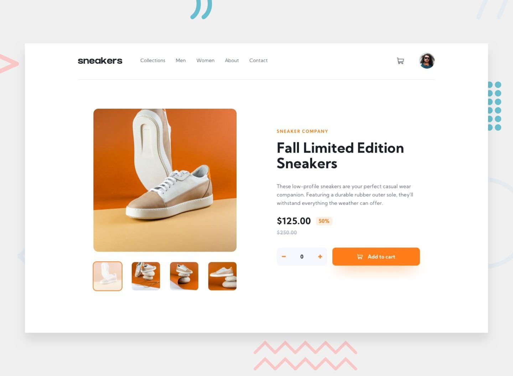

Saudações, a todos!

Em uma live mostrei a construção do website que esta na ilustração partindo do zero e usando Sass e Html.

O objetivo relacionado a estrutura foi atingido. Por agora vou  acrescenta as funcionalidades como responsividade e eventos de interação com usuário utilizando JS.

.Surgiu para mim a necessidade de expandir este mesmo projeto. Para além de ter uma pagina única como na ilustração, criarei as restante(2) e ei de implementa uma api por onde vai consumir os dados. 

API será construída com as tecnologias Node+MySql.

Este será um projeto continuo e os deploy serão atomaticos 

 

